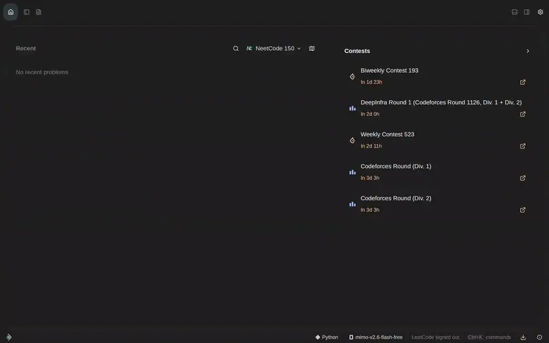
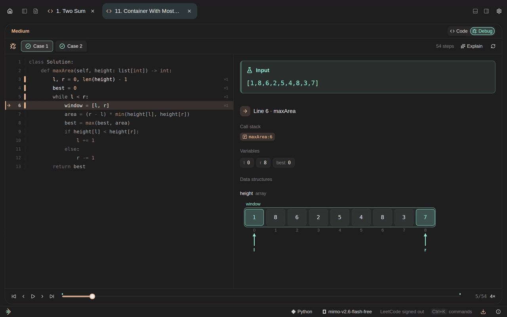
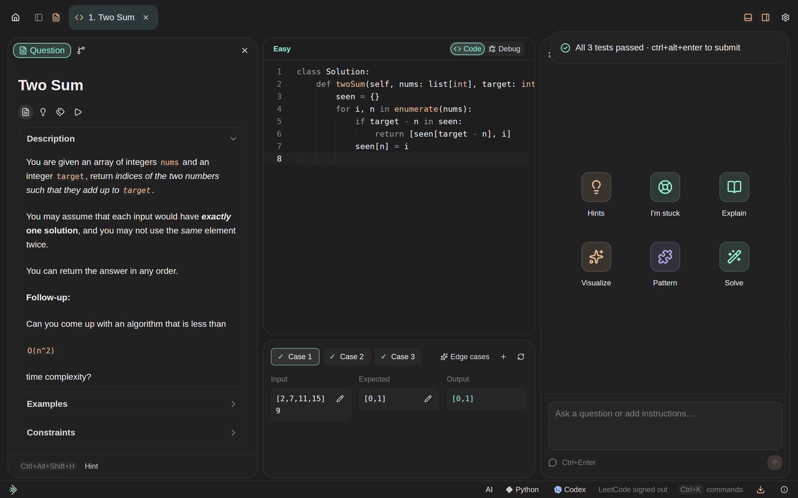
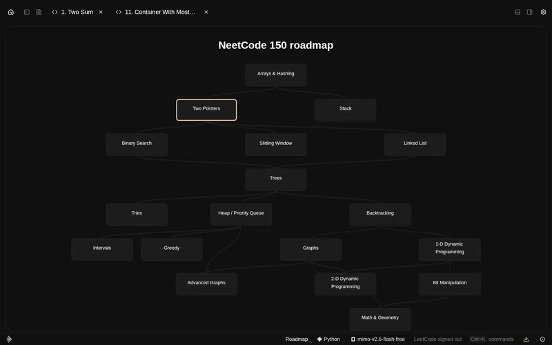
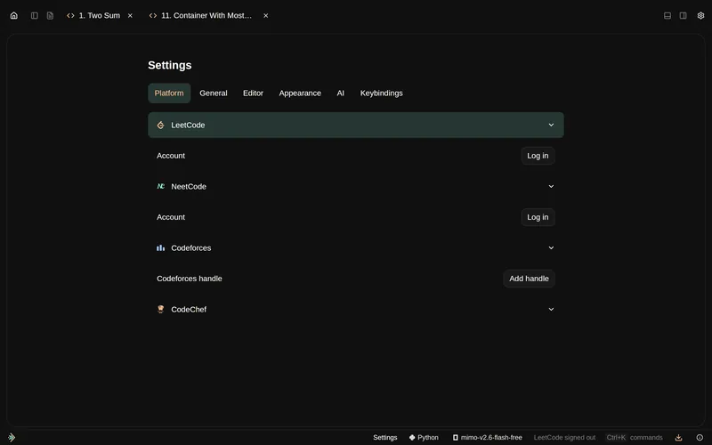

# leet

<p align="center">
  <a href="https://noelithub77.github.io/leet/"></a>
</p>

<p align="center">
  <a href="https://github.com/Noelithub77/leet/releases/latest"></a>
  <a href="LICENSE"></a>
  <a href="https://github.com/Noelithub77/leet/actions/workflows/release.yml"></a>
  <a href="https://github.com/Noelithub77/leet/actions/workflows/pages.yml"></a>
  <a href="https://github.com/Noelithub77/leet/stargazers"></a>
</p>

A native, keyboard-first coding-practice IDE in **idiomatic Rust**, powered by **GPUI**. Practice, debug, ask your local AI agents, and prepare for contests in one calm workspace.

**Leeting @ 120Hz.** Built to follow your display’s refresh rate; actual frame cadence depends on your hardware and workload.

## Quick install

**Linux & macOS** — copy into your terminal; the installer downloads and launches leet.

```sh
curl -fsSL https://noelithub77.github.io/leet/install.sh | sh
```

<p align="center">
  <a href="https://github.com/Noelithub77/leet/releases/latest/download/leet-windows-x86_64.exe"></a>
  &nbsp;&nbsp;
  <a href="https://noelithub77.github.io/leet/"></a>
</p>

## See it in motion

[](site/public/media/flow.mp4)

| Deterministic visual debugger | Your local AI agents |
| --- | --- |
| [](site/public/media/debugger.mp4) | [](site/public/media/ai.mp4) |

## A complete practice workspace

- **Deterministic debugging.** Record execution, step forward or back, inspect variables and visual state, and replay the same run. Python and C++ traces include contest stdin programs.
- **Local AI, native UI.** Use your installed agents in chat, solution reviews, hints, complexity analysis, and visual walkthroughs. Choose providers and models without leaving the problem.
- **Contest companion.** Import Competitive Companion/CPH problems and samples; practice Codeforces and CodeChef alongside LeetCode and NeetCode.
- **An editor that stays out of your way.** Language-server support, syntax highlighting, saved problem tabs, local cases, results, and Git-backed solution history.
- **Roadmaps and offline practice.** NeetCode 150 is the default. The public SQLite bundle includes full NeetCode 150 and 100 CodeChef practice statements/samples; other catalogs have metadata and fetch statements on demand. [Coverage & provenance →](docs/bundle.md)
- **Rust + GPUI.** Native rendering, compact panels, progressively disclosed controls, and keyboard navigation. Both application crates forbid unsafe Rust.

| Roadmaps | Vesper and more |
| --- | --- |
|  |  |

Defaults: **NeetCode 150 · Python · Liberation Sans · Vesper with pastel accents**. Launch with `leet` or `1337`; try `leet --1337` for a small Easter egg.

<details>
<summary>Everyday shortcuts</summary>

| Shortcut | Action |
| --- | --- |
| `Ctrl+H` | Home |
| `Ctrl+T` | Search |
| `Ctrl+Tab` / `Ctrl+Shift+Tab` | Next / previous problem |
| `Ctrl+W` / `Ctrl+Shift+T` | Close / reopen a problem |
| `Alt+S` / `Alt+A` / `Alt+D` | Explorer / Description / AI |
| `Alt+X` | Results |
| `Alt+Z` | Focus the editor |
| `Ctrl+Shift+P` | All commands |

See [development and shortcuts](docs/development.md) for the full reference.

</details>

## Build and contribute

```sh
git clone https://github.com/Noelithub77/leet.git
cd leet
./ops --help
./ops check --json
./ops local:deploy --json
```

Rust and GPUI’s platform build dependencies are required for source builds. Running local solutions requires Python or the relevant compiler; language servers are discovered separately. See [development](docs/development.md) and [contributing](CONTRIBUTING.md).

For the landing page:

```sh
pnpm --dir site install --frozen-lockfile
pnpm --dir site dev
# http://localhost:1337/leet/
```

[Changelog](docs/changelog.md) · [Report a bug](https://github.com/Noelithub77/leet/issues/new?template=bug_report.yml) · [Suggest a feature](https://github.com/Noelithub77/leet/issues/new?template=feature_request.yml) · [Security policy](SECURITY.md) · [Code of conduct](CODE_OF_CONDUCT.md)

## License

Current source is licensed under **GNU AGPL v3**, [`AGPL-3.0-only`](LICENSE). Earlier releases retain the license in their own tag. Fonts, provider/language icons, bundled public problem content, and dependencies retain their own licenses and attribution; see [bundle provenance](docs/bundle.md) and the notices beside those assets.
